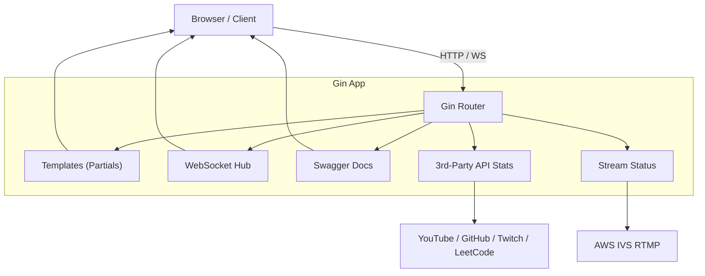
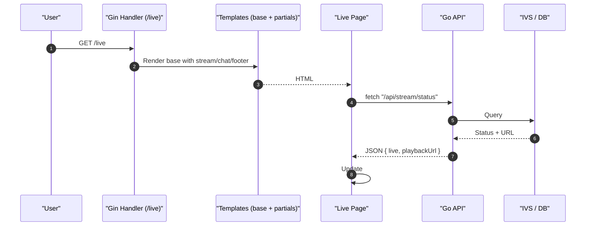
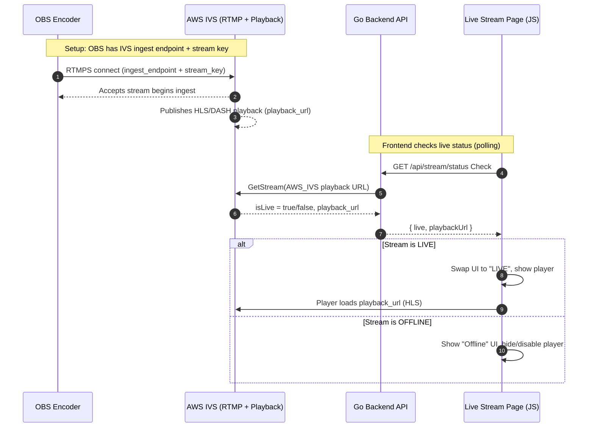

# majesticcoding.com in Golang

Welcome to majesticcoding.com.  This was built in Golang with a `Gin API with Swagger`, `AWS IVS RTMP` for `Live Streams`, `Websockets` for `Live Chatting`, `Neon Postgres` for relational database, `Vanilla JS` + `Tailwind CSS` in `Partial templates` on the UI.

### Run with Docker 🐳
```
docker compose up
```
### Run with Go 🐹
```
go run .
```

## Technical Documentation

The following are diagrams outlining the structure of the main functionality of this Go application.

### Gin API with Swagger Architecture Diagram



### UI Architecture Diagram




### Live Stream Architecture Diagram


